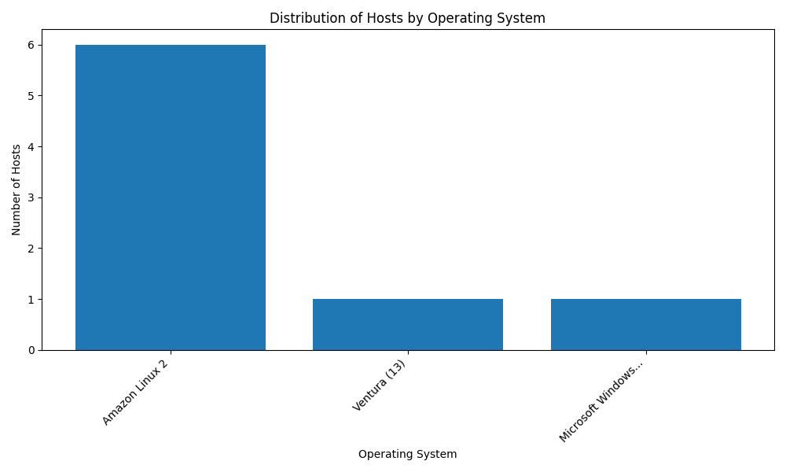
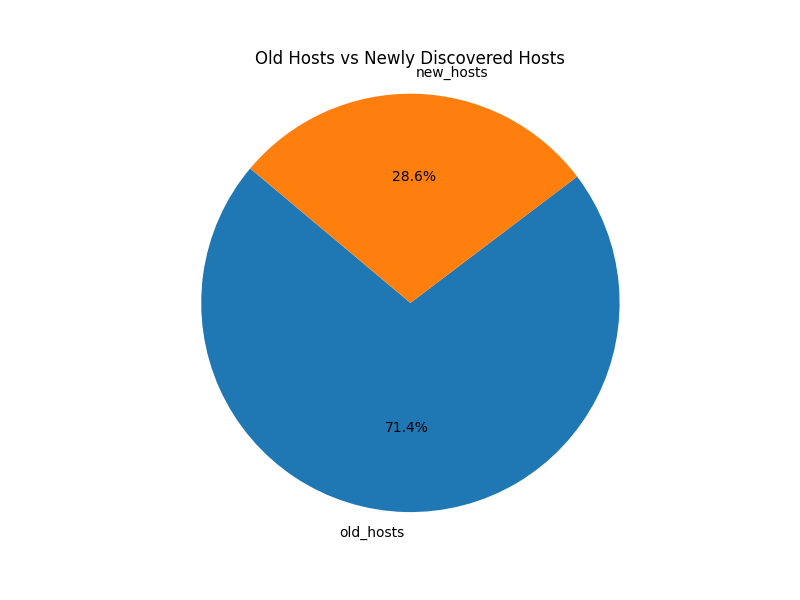
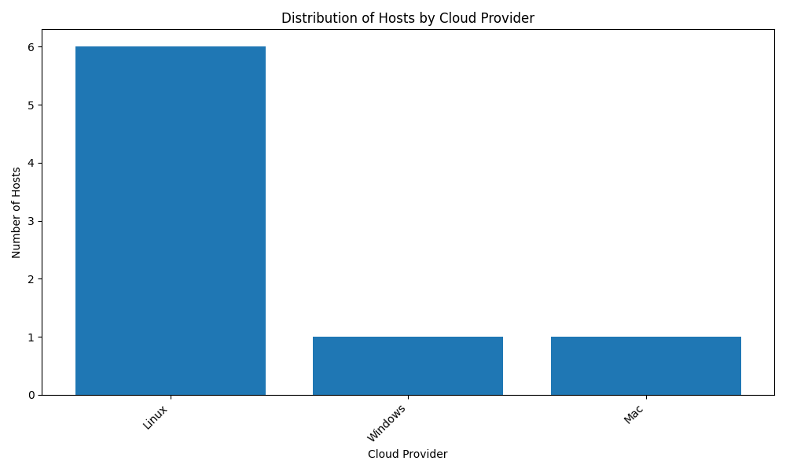

# Silk Data Pipeline

## Overview
Silk Pipeline is a project designed to fetch host data from Qualys and CrowdStrike, merge it into a single database, and remove duplicates based on hostname, IP address, and other criteria. Currently, only common fields are normalized, but additional fields can be included as needed and and based on usecases.

## Setup
1. Ensure Python >= 3.8 is installed. (Tested in 3.8.10)
2. Install MongoDB and start the MongoDB server.
3. Install required packages:

## To run the project

1. Navigate to project Dir `silk_pipeline`
2. pip install -r requirements.txt 
3. Enter `python main.py`

## Output

1. Os Distribution

2. Host Age Distribution 

3. Cloud Provider Distribution
